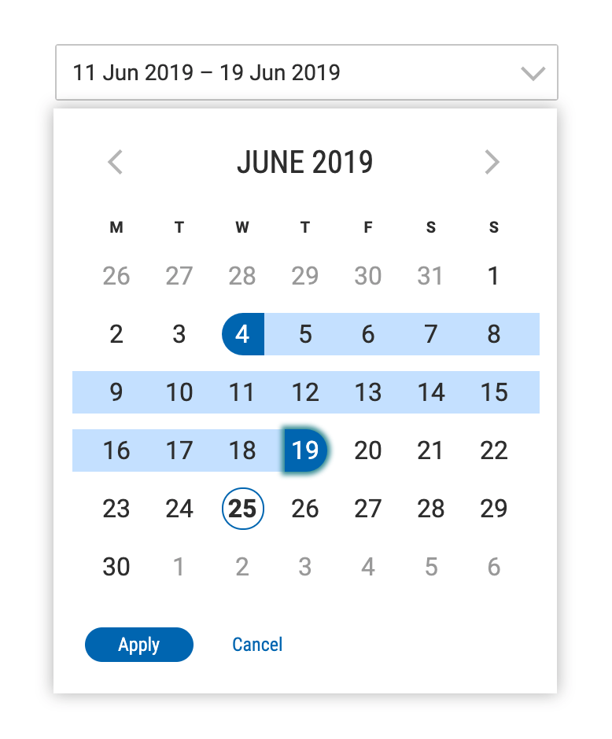

# Glu Datepicker React

## Description

A datepicker user interface built from scratch using React and Moment. Has many configuration options.

## Installation instructions

  1.  npm ci
  
## Scripts

In package.json

* build
  * Builds the code with the output going into the dist directory (which is deleted prior to building)
* devPackage
  * Runs the following scripts: lint, test, build
  * cd's into the dist directory and runs npm pack
  * The final result is a npm packed tgz file that is essentially a built and npm packaged module. This tgz can be installed locally via a file url, ie "file:../glu-data-lens/dist/glu-data-lens-0.64.0.tgz", in place of the version number in any package.json file if you wish to test the build.
* lint
  * Runs eslint on the code
* test
  * Runs all the unit tests on the code
* storybook
  Starts up storybook which does a build first and then launches the storybook server so you can view storybook locally.

## Usage

Usage information is contained in the Usage section of storybook which contains examples for most common use cases. 

Follow the install instructions above, run npm run storybook, then goto http://localhost:6006 and open the usage section to see the examples.

## Options
    
Modules's options are its props which are documented in all of the examples in storybook that use this component with the info addon. Just click the info button on the examples.

## Release
* Versioning of Glu module, is maintained by Jenkins [ux-nexus](http://ux-jenkins.saas-n.com/) and hosted on internal Bottomline NPM registry.
* Based on module files `.npmrc`, `package.json`, `.npmignore`.
* More details you can find on page [Glu Versioning](https://confluence.bottomline.tech/pages/viewpage.action?pageId=112582120).

## Questions?
Send an email to [glu.buttonline.com](glu@bottomline.com) 

See also [Contribute to Glu](https://confluence.bottomline.tech/display/UX/Contribute+to+Glu)
